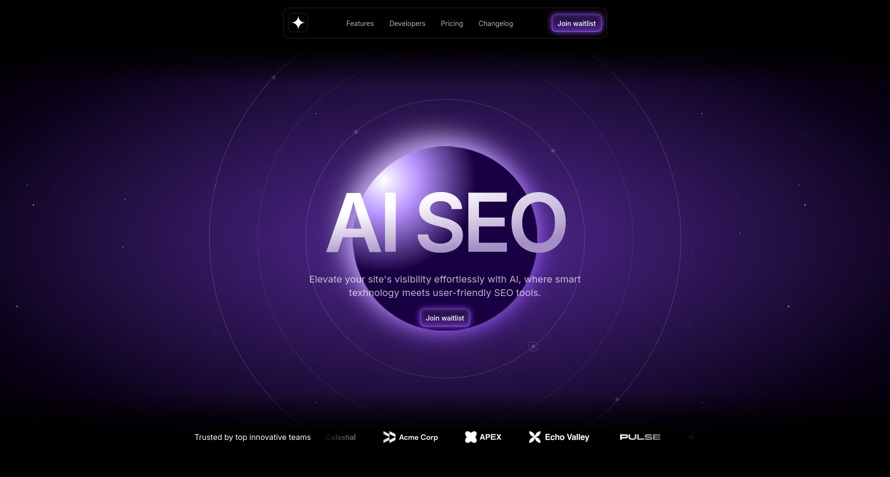

# Cogni

Cogni, a modern AI SEO landing page built with Next.js, Tailwind CSS, Framer Motion. This project showcase a sleek design with smooth hover and parallax effects and animations.



## 🌟 Features

- Responsive design that looks great on all devices
- Smooth animations using Framer Motion
- Snoothing hero section with animations and parallax effects
- Interactive Call to Action section
- Logo ticker for brand showcasing
- Interactive product showcasing section
- Animated product image

## 🌐 Live Site

Check out the live site: [Cogni](https://cogni-tau.vercel.app)

## ⚙️ Tech Stack

- [Next.js](https://nextjs.org/)
- [React](https://reactjs.org/)
- [TypeScript](https://www.typescriptlang.org/)
- [Tailwind CSS](https://tailwindcss.com/)
- [Framer Motion](https://www.framer.com/motion/)

## 🏁 Getting Started

### Prerequisites

- Node.js (v14 or later)
- npm or yarn

### Installation

1. Clone the repository

```sh
git clone https://github.com/nuralam123/cogni.git

```

2. Navigate to the directory

```sh
cd cogni
```

3. Install dependencies

```sh
npm install
# or
yarn install
```

4. Run the development server

```sh
npm run dev
# or
yarn run dev
```

5. Open [http://localhost:3000](http://localhost:3000) in your browser to see the result.

## 🎨 Design

The design for this project was created by Frontend Tribe. You can find the Figma design file here:
[AI Startup landing page](https://lp.frontendtribe.com/ai-startup-landing-page-resource-bundle)

## 🤝 Contributing

Contributions, issues, and feature requests are welcome! Feel free to check the [issues page](https://github.com/NurAlam123/cogni/issues).

1. Fork the project
2. Create your feature branch (`git checkout -b feature/AmazingFeature`)
3. Commit your changes (`git commit -m 'Add some AmazingFeature'`)
4. Push to the branch (`git push origin feature/AmazingFeature`)
5. Open a pull request

## 📝 License

This project is open source and available under the [MIT License](./LICENSE.md).

### Acknowledgements

- This project was originally showcased at [Frontend Tribe](https://www.youtube.com/@frontend-tribe) YT channel.
- Tutorial video: [Create a Stunning AI Landing Page from Scratch](https://youtu.be/Z7I5uSRHMHg)
- Design inspiration and assets from [Frontend Tribe's Figma Design](https://lp.frontendtribe.com/ai-startup-landing-page-resource-bundle)

While the implementation code is licensed under the MIT License, please note that this does not extend to any design assets or other resources provided by Frontend Tribe. For usage of those elements, please refer to Frontend Tribe's terms and conditions.
